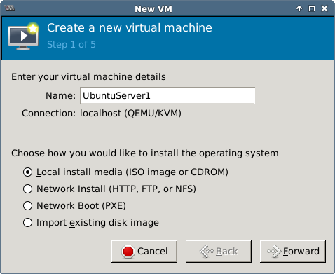
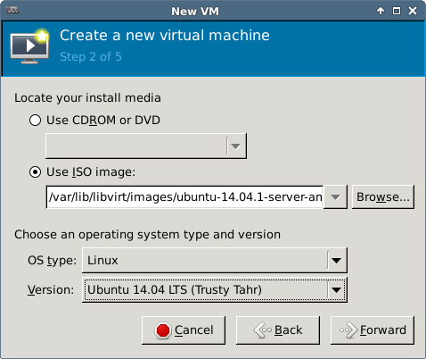
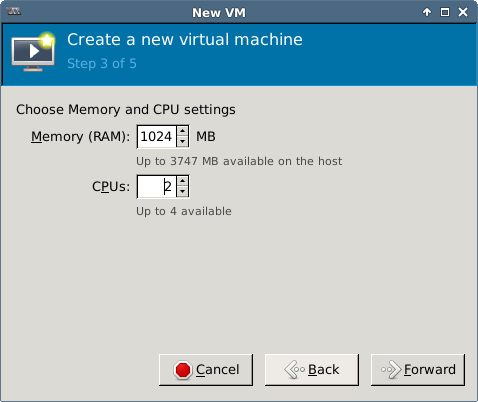
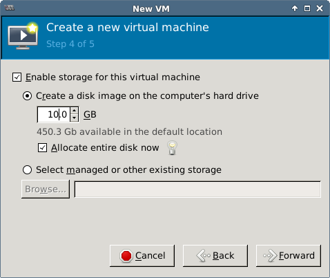
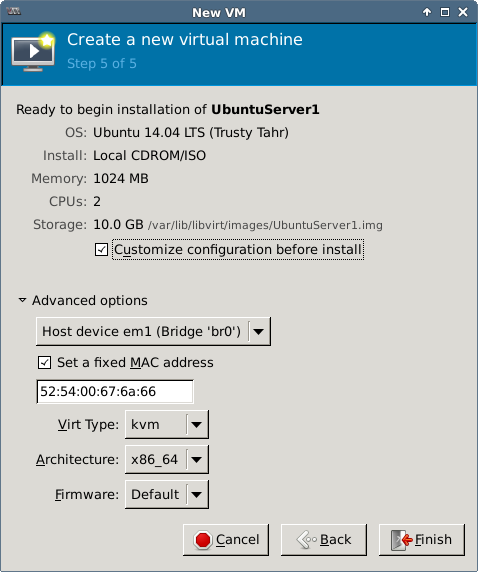
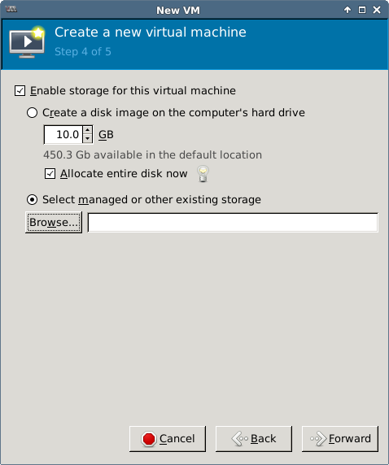
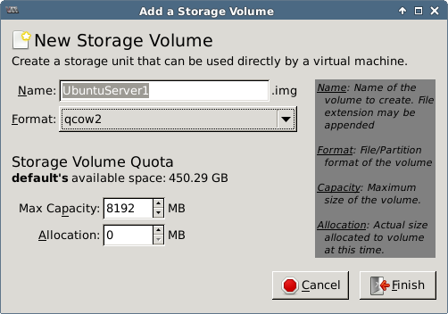
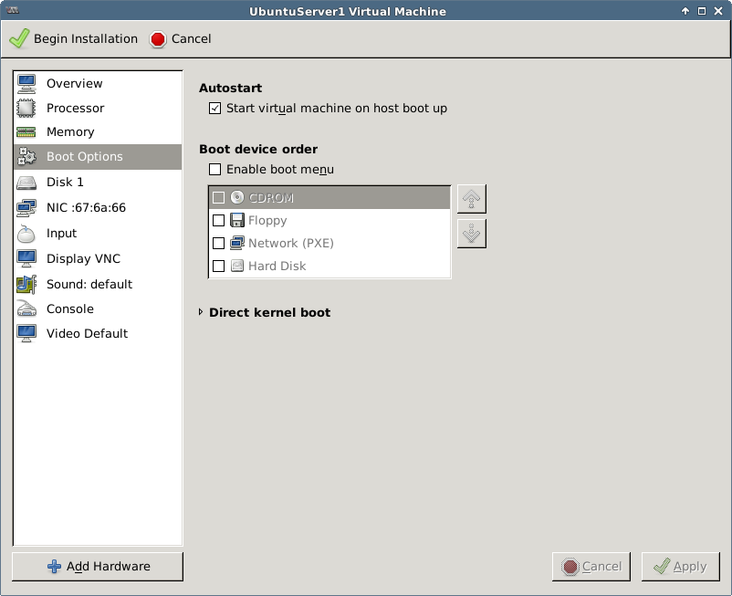
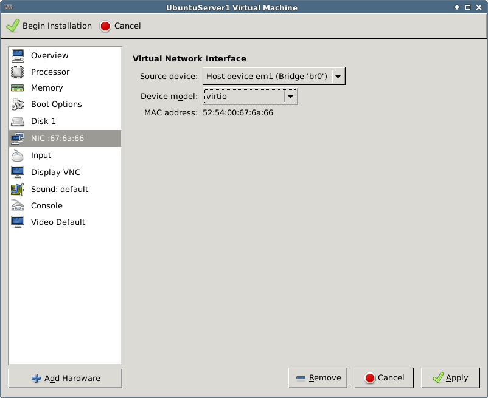
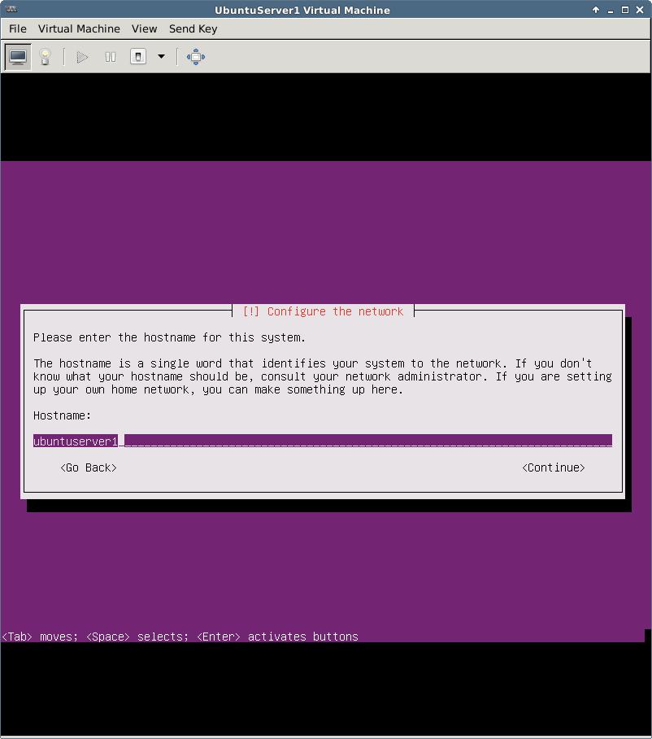

This document contains the steps required for installing and configuring a KVM virtual host server
for use as virtualized development lab environment.
The main requirements were exposing all virtual machines to the local area network (bridged networking)
and being able to connect to the host from windows clients using the Remote Desktop Protocol.
The underlying hardware at the time of writing was a Lenovo ThinkServer TS140
and the chosen operating system was Ubuntu Server 14.04 LTS.

Hardware & BIOS Setup
====================
- BIOS upgrade using a bootable DOS usb stick. Without the BIOS upgrade, system boot invariably failed if an external USB FDD was attached.
- Boot to BIOS. There's also an option to use an EasySetup disk, but apparently it's only useful when installing a windows OS or VMware ESXi.
- Enable virtualization extensions in CPU setup (VT)
- Enable VT-d as well if direct exclusive device assignment to guests is needed
(see [here][KVM VT-d]).

Operating System
====================

Install Ubuntu Server 14.04 LTS

- Basic Ubuntu Server
- OpenSSH server
- Xfce instead of gnome for RDP connectivity (gnome does not work well with RDP on Ubuntu 14.04)
- KVM is left unselected in this phase and installed through apt-get later

Remote desktop connectivity is explained in a separate document: [Using xRDP for Remote Desktop Access].

KVM Installation & Host Configuration
====================

Checking Hardware Virtualization Support
------------------------------

`egrep '(vmx|svm)' --color /proc/cpuinfo` should display vmx or svm in red.

`egrep -c '(vmx|svm)' /proc/cpuinfo` should give non-zero result.

`kvm-ok` should give message saying:

> INFO: /dev/kvm exists  
> KVM acceleration can be used
{: .terminal}

`virt-host-validate` should give message:

> QEMU: Checking for hardware virtualization		: PASS  
> QEMU: Checking for device /dev/kvm				: PASS  
> QEMU: Checking for device /dev/vhost-net		: PASS  
> QEMU: Checking for device /dev/net/tun			: PASS  
> LXC: Checking for Linux >= 2.6.26				: PASS
{: .terminal}

`lsmod | grep kvm` should list either kvm_intel or kvm_amd

Installing KVM and Command Line Management Tools
------------------------------

Install the following packages using apt-get:

- `ubuntu-virt-server` metapackage that contains:
	- `qemu-kvm`
	- `libvirt-bin`
	- `openssh-server`
- `bridge-utils` to manage bridged networking (brctl etc.)
- `ubuntu-vm-builder` (one option for building virtual machines)
  - `python`
  - `python-vm-builder`
- `ubuntu-virt-mgmt` metapackage that contains:
	- `virt-viewer` (for viewing vms)
	- `virt-manager` (GUI for VM management)
- `virtinst`
- `qemu-system`
- `libguestfs-tools` (tools for accessing and modifying virtual machine disk images)

The current user is added to libvirtd group automatically. Use `sudo usermod -a -G libvirtd <user>` to add other users if necessary (log out and back in).
Check also that you belong to the kvm group and if not, run `sudo usermod -a -G kvm <user>`.

For libguestfs tools like `virt-cat`, `virt-edit` and `virt-sysprep` to work (on Ubuntu), run the following commands after installing the package.
For more detailed instructions see [here](http://libguestfs.org/guestfs-faq.1.html#downloading-installing-compiling-libguestfs).


sudo update-guestfs-appliance
sudo chmod 0644 /boot/vmlinuz*


Bridged Networking
====================

Setup Bridge on the Host
------------------------------

Setting up the bridge requires the bridge-utils package installed in the previous section.
The bridge connects the virtual machines' virtual network interfaces (taps) directly to the local area network
through the host server's primary network interface as if the virtual machines were
physically present in the local area network along with the host.



Check the device name of the primary network interface using `nmcli dev status`.
The device name in this case is em1 (biosdevname naming for integrated network interfaces).

> If network manager is in use, you may want to [disable it](http://xmodulo.com/disable-network-manager-linux.html) before continuing (not necessary though).
> 
> On a local session, run `stop network-manager` (don't do this unless on a local session, kills the network connectivity entirely)
> and `echo "manual" | sudo tee /etc/init/network-manager.override`
{: .note }

Edit `/etc/network/interfaces` to disable primary interface (eth0/em1) unless controlled by network manager (no problem if it is), add bridge (with primary interface as bridged port).


auto br0
iface br0 inet dhcp
    bridge_ports em1
    bridge_stp off
    bridge_fd 0
    bridge_maxwait 0


Restart networking `/etc/init.d/networking restart`.

`ifconfig` should show br0 with a valid ip address.

`brctl show` should show br0 connected to interface em1 and another bridge virbr0 (kvm private networking bridge).

`nmcli dev status` should show em1 as unmanaged (even without disabling network manager).

After starting a guest vm, a virtual interface should show on the bridge as well (e.g. vnetX or tapX).

Additional Bridge Setup Steps
--------------------------

These steps may improve the performance of the bridge (see [Libvirt Networking]) TODO Verify.

Add the following to `/etc/sysctl.conf`:


net.bridge.bridge-nf-call-ip6tables = 0
net.bridge.bridge-nf-call-iptables = 0
net.bridge.bridge-nf-call-arptables = 0


and run `sysctl -p /etc/sysctl.conf`.

Add the following to `/etc/rc.local` before the line with `exit 0`:


/sbin/sysctl -p /etc/sysctl.conf
iptables -A FORWARD -p tcp --tcp-flags SYN,RST SYN -j TCPMSS  --clamp-mss-to-pmtu


Create a Virtual Network Using the Existing Bridge
---------------------------------

This is an optional step and is not required for bridged networking.
However a virtual network must exist for operations that rely on a named network, such as creating virtual machines with docker-machine.

Create the following network specification:


<network>
  <name>host-bridge</name>
  <forward mode="bridge"/>
  <bridge name="br0"/>
</network>


Then run `virsh net-create <file name>`

Guest Configuration	
------------------------------

Each guest needs a separate mac address. The `kvm` and `virt-install` commands as well as VMM autogenerate a valid mac address if not explicitly specified.
The below script can be used to generate valid mac addresses ([KVM Networking]) if you want to specify them manually.


MACADDR="52:54:00:$(dd if=/dev/urandom bs=512 count=1 2>/dev/null | md5sum | sed 's/^\(..\)\(..\)\(..\).*$/\1:\2:\3/')"; echo $MACADDR


The manually created mac address can be specified in the virsh domain xml:


<interface type='bridge'>
  <mac address='00:11:22:33:44:55'/>
  <source bridge='br0'/>
  <target dev='vnetX'/>
  <model type='virtio'/>
  <alias name='net0'/>
  <address ... />
</interface>


When installing the VM with `virt-install`, the following parameters can be used: `--network bridge=br0,model=virtio,[mac=<predefined mac address>]`
(or `--network network=<network name>,model=virtio` if you have created a libvirt virtual network using the bridge).

In VMM the bridge is configured during installation or later in the NIC section:



For more network related instructions, see [Libvirt Networking], [KVM Networking] and [KVM Networking (Ubuntu)].

Creating Guests
====================

> Debian based systems have the script `/usr/bin/kvm` by default, that executes
> `qemu-system-x86_64 -enable-kvm <parameters>`. Use the latter if the kvm command is not available.
{: .note }

About Guest Images
------------------------------

- Processor features: use `-cpu host` with qemu to pass all host processor features to guest
(don't use if need to have portable image).
- Use virtio for networking if available (rtl8139 and e1000 have better guest support but virtio
has better performance). For example, rtl18139 works with XP out of the box while e1000 and virtio do not.
- Use virtio for storage if available (best performance, but IDE has better support for guests). For example Windows OSes work with IDE or SATA out of the box but not with virtio.
- Easiest storage formats for images are qcow2 and raw. The latter gives better performance but
reserves all allocated space when created. Disable cache when using raw.
- libvirtd logs from kvm commands are written into `/var/log/libvirtd/qemu/<guest name>.log`

More about tuning guest performance [here][KVM Tuning].

Storage Pools
------------------------------

Virsh can manage disk images in different kinds of storage pools.
The default pool is a directory pool, which refers to a directory on the local disk.
Manually created images can be added under libvirt management regardless of the location on disk.
However, VMM and `virt-install` can create new image files only inside storage pools.
Therefore, if you want to store the images outside of the default pool,
you must either create a new pool or always create the image file first separately using `qemu-img`.

Use `virsh pool-list` to view existing pools (a single, default pool exists after installation).
Examine the xml returned by e.g. `virsh pool-dumpxml default` to view e.g. the directory location of a pool.


<pool type='dir'>
  <name>default</name>
  <uuid>71b996d7-ffe6-5cb1-f6f4-94155ce25ba2</uuid>
  <capacity unit='bytes'>488111095808</capacity>
  <allocation unit='bytes'>24755052544</allocation>
  <available unit='bytes'>463356043264</available>
  <source>
  </source>
  <target>
    <path>/var/lib/libvirt/images</path>
    <permissions>
      <mode>0711</mode>
      <owner>-1</owner>
      <group>-1</group>
    </permissions>
  </target>
</pool>


To create a new directory pool, run the following commands:


virsh pool-define-as --name <pool name> --type dir --target <directory path>
virsh pool-autostart <pool name>
virsh pool-start <pool name>


After this, new images can be created with `virt-install` or VMM in the new directory path.
A more advanced discussion on storage pools is outside the scope of this document.

Creating a Disk Image and Installing a Guest OS
------------------------------

> Installation of guest OSes from cds, dvds or iso images usually requires that the user is able
> to interact with the operating system console (display, keyboard, mouse).
> The most straightforward way to accomplish this is to have an X session on the host (either physically
> or remotely, e.g. RDP or VNC).
> Guest installation on a headless server requires connecting to the guest machine over the network using VNC after starting the installation on the command line.
{: .note }

A lot of pre-installed images are available from various sources, for example:

- [CoreOS](http://stable.release.core-os.net/amd64-usr/current/)
- [Ubuntu Cloud Images](http://cloud-images.ubuntu.com/)

The information in section Cloning Guests applies also for using pre-installed images.

TODO How to set up grub so that boot sequence never gets stuck in the boot menu.

###Manually

Create a disk image with `qemu-img create -f qcow2 vdisk.img <disk size gigabytes>G`.

Install the operating system from an installation media:


sudo kvm -hda vdisk.img -cdrom /path/to/boot-media.iso -boot d -m <memory in megabytes> -net nic,model=virtio -net tap`


The `-boot d` option instructs the OS to boot from the first CD-ROM drive.
The `-net nic,model=virtio -net tap` part enables bridged networking.
Replace virtio with some other network hardware model (e.g. rtl8139) if the guest OS does not support virtio.
The kvm command with bridged networking must be run with root privileges unless the current user is granted permission to manipulate `/dev/net/tun` (this is not a problem when using VMM or virt-install).
You can manually specify a mac address for the network interface, e.g.: `-net nic,model=virtio,macaddr=00:00:10:52:37:48`.

In a headless environment, you need to connect to the guest with a VNC client after starting the installation:

- Add the following parameters to the kvm command: `-vnc :X -no-reboot` where X is the vnc display number (e.g. 2) which corresponds to a tcp port number in the range 59XX (e.g. 5902).
The `-no-reboot` switch prevents the OS from rebooting automatically after installation.
- Connect to TCP port 59XX of the host machine (e.g. 5902) with a vnc viewer to complete the installation.

To password-protect the vnc session, add `,password` to the `-vnc` option.
An additional option `-monitor stdio` is required to get access to the qemu monitor (prompt `(qemu)`) where the vnc password is set.


$ sudo kvm -hda vdisk.img ... -vnc :X,password -monitor stdio`
QEMU 2.0.0 monitor - type 'help' for more information
(qemu) change vnc password
Password: *****


Type `quit` in the `(qemu)` prompt to terminate the virtual machine and exit the monitor.

You can use the `-nographic` option to open the guest console directly in the terminal if the guest OS supports it (exit terminal mode with Ctrl-A X).

More options:

- `-no-acpi` use this if guest is having problems with ACPI.
- `-localtime` set rtc to local time instead of utc. Required at least for DOS or Windows.
- `-usb -usbdevice tablet` for a better mouse experience in graphical mode (mouse control is better but may still be laggy).

After installation, the image can be started up with the same command line by removing the boot command or by changing it to boot from the first hard disk instead of the installation media (e.g. `-boot c`).
The installation media option `--cdrom ...` can also be removed.


sudo kvm vdisk.img -m <memory in megabytes> -boot c [-snapshot]
  -net nic,model=virtio -net tap


The `-boot c` option is the default and instructs the OS to boot from the first hard disk.
You can use the `-snapshot` option to prevent any changes to be written on the disk image itself (writes to temp files instead).
In a headless environment, you can use the `-nographic` option to run in terminal mode if the guest OS supports it (exit terminal mode with `Ctrl-A` `X`).

If you need to [Find the IP of a running VM] and the mac address is known, run `arp -an | grep <mac address of the VM>`

An example for installing and running a Windows XP guest:

sudo kvm -hda xp.img -cdrom /path/to/image.iso -boot d -m 1024
  -net nic,model=rtl8139 -net tap
  -localtime -no-acpi -usb -usbdevice tablet
sudo kvm -hda xp.img -boot c -m 1024
  -net nic,model=rtl8139 -net tap
  -localtime -no-acpi -usb -usbdevice tablet


The resulting image can be imported to be managed under libvirt using either `virt-install` or VMM.
A third method is to create a domain xml file manually and use the virsh commands (see section [Managing Guests](#Managing_Guests)) to define the virtual machine.

###With virt-install

The `virt-install` command can be used to create new or to import existing virtual machines.
The following command creates a new image and installs a system on it.
Note the size in the `--disk` argument and the installation media specified using the `--cdrom` argument.
The disk location must point to a directory that belongs to a storage pool.


virt-install --name <guest name> --ram <memory in megabytes> --vcpus <no of cpus>
  --network bridge=br0,model=virtio[,mac=<predefined mac address>]
  --os-type=linux --os-variant=ubuntutrusty
  --disk path=<path-to-disk-image>.img,bus=virtio,format=qcow2,size=<disk size in GB>
  --cdrom=<path-to-installation-media>.iso


In a headless environment, you need to connect to the guest with a VNC client after starting the installation:

- Add the following parameters to the `virt-install` command: `--graphics vnc,listen=0.0.0.0,port=59XX,password=<pwd>` where 59XX is the tcp port number for a vnc display (e.g. 5902 for display no. 2)
- Connect to TCP port 59XX of the host machine (e.g. 5902) with a vnc viewer and supply the specified password to complete the installation.

The following command imports an existing disk image.
The `--import` switch skips installation phase and the `--noautoconsole` switch prevents the command from automatically connecting to terminal or vnc display.
Note also that there is no disk size specified for the `--disk` parameter.


virt-install --name <guest name> --ram <memory in megabytes> --vcpus <no of cpus>
  --network bridge=br0,model=virtio[,mac=<predefined mac address>]
  --os-type=linux --os-variant=ubuntutrusty
  --disk path=<path-to-disk-image>.img,bus=virtio,format=qcow2
  --import
  --noautoconsole


The `--os-type` and `--os-variant` parameters can be used to set some useful default settings for the VM.
The supported OS Type values in VMM are Generic, Linux, Other, Solaris, UNIX and Windows. I haven't seen these documented elsewhere.
The available OS Variants can be listed by running the command `virt-install --os-variant list`. The `--os-type` parameter is not required if `--os-variant` is used.

For example, to install Windows Server 2012 R2:


virt-install --name WindowsServer1 --ram 2048 --vcpus 2
   --network bridge=br0,model=e1000
   --os-variant=win2k8
   --disk path=<path-to-disk>.img,bus=sata,format=qcow2,size=10
   --cdrom=<path-to-windows_server_2012_r2_x64_dvd>.iso


For linux guests, the ttyconsole should be automatically created, check with `virsh ttyconsole <guest name>`.

The newly created VM should show up in both `virsh list --all` and VMM.

You can use the `--nographics` option to open the guest console directly in the terminal if the guest OS supports it (exit terminal mode with Ctrl-A X).

###With VMM (virt-manager)

Launch `virt-manager` or Virtual Machine Manager from system menu on xfce.
The tool creates new images in the default storage pool `/var/lib/libvirt/images/` by default.

<ul class="clearing-thumbs small-block-grid-4" data-clearing>
  <li></li>
  <li></li>
  <li></li>
  <li></li>
  <li></li>
  <li></li>
  <li></li>
  <li></li>
  <li></li>
  <li></li>
</ul>

Execute `virsh list` to see the image now running under virsh.

Curious people can look in `/var/log/libvirt/qemu/<guest name>.log` to see the kvm command used for the installation.


/usr/bin/kvm-spice -name UbuntuServer1
	-S
	-machine pc-i440fx-trusty,accel=kvm,usb=off
	-m 1024
	-realtime mlock=off
	-smp 2,sockets=2,cores=1,threads=1
	-uuid 87da8396-5ef0-f851-aa86-e680ba49c882
	-no-user-config
	-nodefaults
	-chardev socket,id=charmonitor,path=/var/lib/libvirt/qemu/UbuntuServer1.monitor,server,nowait
	-mon chardev=charmonitor,id=monitor,mode=control
	-rtc base=utc
	-no-shutdown
	-boot strict=on
	-device piix3-usb-uhci,id=usb,bus=pci.0,addr=0x1.0x2
	-drive file=/var/lib/libvirt/images/UbuntuServer1.img,if=none,id=drive-virtio-disk0,format=qcow2
	-device virtio-blk-pci,scsi=off,bus=pci.0,addr=0x5,drive=drive-virtio-disk0,id=virtio-disk0,bootindex=1
	-drive if=none,id=drive-ide0-1-0,readonly=on,format=raw
	-device ide-cd,bus=ide.1,unit=0,drive=drive-ide0-1-0,id=ide0-1-0
	-netdev tap,fd=24,id=hostnet0,vhost=on,vhostfd=25
	-device virtio-net-pci,netdev=hostnet0,id=net0,mac=52:54:00:67:6a:66,bus=pci.0,addr=0x3
	-chardev pty,id=charserial0
	-device isa-serial,chardev=charserial0,id=serial0
	-vnc 127.0.0.1:0
	-device cirrus-vga,id=video0,bus=pci.0,addr=0x2
	-device intel-hda,id=sound0,bus=pci.0,addr=0x4
	-device hda-duplex,id=sound0-codec0,bus=sound0.0,cad=0
	-device virtio-balloon-pci,id=balloon0,bus=pci.0,addr=0x6


To import an existing image, select the "Import existing disk image" option when creating a new VM.

### With vm-builder

TODO https://www.howtoforge.com/virtualization-with-kvm-on-ubuntu-12.10 for vmbuilder, LVM-based virtual machines

Console Access to Linux Guest From Host
------------------------------

`virsh ttyconsole <name>` should give e.g. `/dev/pts/<number>`

`virt-install` and VMM should create the following in the domain definition by default


<console type='pty'>
	<target port='0'/>
</console>


Use `echo $TERM` output on host to determine which terminal to use in the command (`xterm` is used here)

See [KVM Access] for more details.

###On Guest

Create file `/etc/init/ttyS0.conf` with contents:

start on stopped rc RUNLEVEL=[2345]
stop on runlevel [!2345]
respawn
exec /sbin/getty -L 115200 ttyS0 xterm


Execute `start ttyS0`

###On Host

Execute `virsh connect <domain>`. Press enter to get login prompt.  

Use `Ctrl + ]` or `Ctrl + 5` or `Ctrl + [^¨~]` to exit the console (depends on key map which escape
key works, see [How to exit virsh].

Mouse Integration
------------------------------

If you're experiencing problems while using the mouse on the guest system, try switching to a virtual tablet input device (absolute coordinates instead of relative).

Using the `--os-type` or `--os-variant` parameter with `virt-install` should optimize the mouse along with other aspects of the guest.
There does not seem to be an explicit way of adding a tablet device with `virt-install`.

When running manually with `kvm` add parameters `-usb -usbdevice tablet`.

In VMM add new input device:



In the guest definition XML the same is achieved with:


<input type='tablet' bus='usb'>
  <alias name='input0'/>
</input>


Share a Directory on Host to a Guest VM
------------------------------

###Linux Guest

Add the following under the devices section in domain xml.
The label is used with the mount command later on the guest.


<devices>
  ...
  <filesystem type='mount' accessmode='mapped'>
    <source dir='<path on host>'/>
    <target dir='<label>'/>
  </filesystem>
  ...
</devices>


On guest, edit `/etc/modules` and add the following lines if missing:


9p
9pnet
9pnet_virtio


Run `sudo service kmod start` to load the modules or restart the VM.

Run `sudo mount <label> <path on guest> -t 9p -o trans=virtio` or add the following line to `/etc/fstab` to mount automatically on boot.


<label> <path on guest>            9p             trans=virtio    0       0


You may need to experiment with different access modes and host directory permissions to get the read/write permissions right in your scenario.
See these blog posts for more information:

- [File System Pass-Through in KVM/Qemu/libvirt]
- [Sharing directories with virtual machines and libvirt]

###Windows Guest

TODO

Cloning VMs
====================

A cloned virtual machine requires a new Name MAC address, UUID and a new host name (for DNS to work).
You can clone a virtual machine directly using either VMM UI or `virt-clone`.
Another option is to copy the disk image directly and import it with `virt-install --import`.
In all cases the original virtual machine should be shut down before cloning / copying the image.

The last option is useful if you intend to keep template images ready for cloning new servers.
The `virt-sysprep` utility in the `libguestfs-tools` package that can be used to reset/unconfigure/customize/generalize a server image (e.g. add or remove static configuration like MAC address, host name, SSL certs) for this purpose.
The tool does not support windows images currently but probably will in a future version (in the mean time, there's a windows tool `sysprep.exe` that must be run on the guest).
For more information, see here: [virt-sysprep].

All of the options above generate a new Name, MAC and UUID automatically. However, the hostname (and possibly other configuration) must still be set on the new guest itself.

> There's a guide for converting VirtualBox images to KVM images here: [Convert VirtualBox Image to KVM Image]
{: .note }

Cloning the Virtual Machine
------------------------------

Shut down the source guest VM before cloning, e.g. `virsh shutdown <source guest name>`.

**With [virt-clone]**

Execute `virt-clone -o <source guest name> -n <new guest name> -f <path-to-new-disk-image>`.

Configuring the VM
------------------------------

The naïve way to configure the VM is to start it up, connect to it an make the changes there.
This can be done by starting the VM with virsh or VMM and connecting with `virsh console <new guest name>`.
Alternatively, you can run the image directly with kvm and make the same changes there.

- edit both /etc/hostname and /etc/hosts on guest, set new host name in both files
- reboot guest or `sudo hostname <new hostname>`

A better approach (for linux guests) is to use `virt-edit` from the `libguestfs-tools` package.

- `virt-edit -d <new guest name> /etc/hostname`
- `virt-edit -d <new guest name> /etc/hosts`

Instead of the `-d` option for guest name you can use the `-a` option to supply a path to the disk image directly.
Unfortunately the EDITOR environment variable does not affect virt-edit so the command brings up the vi editor by default.
TODO maybe there's another env variable... quick googling did not yield any results.

Libguestfs provides a lot more useful tools for vm image manipulation. See here: [libguestfs].
If you do not have access to `libguestfs-tools`, there's another method described here: [How to clone virtual machines in KVM - tutorial].

Resizing a VM Image
----------------------

With the libguestfs tools, resizing cannot be done in place. Instead, a new image is created based on the old one.
For more information, see the following documents:

- [virt-filesystems]
- [virt-df]
- [virt-resize]

###Expand a single partition (linux)

Example of increasing the disk space on a single partition inside a basic linux VM.
LVM must not be in use and the image must be in the qcow2 format.
Shut down the virtual machine before executing the commands below.

Run `virt-filesystems --long -h --all -a <old guest image>` to list file systems.
Note the name of the partition to expand, e.g. `/dev/sda2`.

Run the following commands:


qemu-img create -f qcow2 -o preallocation=metadata <new guest image> <new total size>G
virt-resize --expand <partition name> <old guest image> <new guest image>


Managing Guests
====================

TODO kvm management tools http://www.linux-kvm.org/page/Management_Tools  
TODO virt-viewer  
TODO VMM  

**Virsh commands**

-	`virsh list --all` shows all VMs managed by virsh
-	`virsh define <filename>.xml` define a new guest / update existing (guest name defined in xml file, changes effective after next boot)
-	`virsh undefine <guest name>`
-	`virsh dumpxml <guest name> > <filename>.xml` dumps the domain xml to given file
-	`virsh edit <guest name>` edit the domain xml for a guest, changes effective after next boot
-	`virsh create <filename>.xml` define and start a new guest
-	`virsh start <guest name>` starts the specified guest VM
-	`virsh destroy <guest name>` hard power off a guest
-	`virsh shutdown <guest name>` send shutdown signal
-	`virsh suspend <guest name>` send suspend signal
-	`virsh resume <guest name>` send resume signal
-	`virsh reboot <guest name>` send reboot signal
-	`virsh console <guest name> [devname]` connect to console on guest (optional device name)
-	`virsh autostart <guest name> [--disable]` sets guest to autostart on host start
-	`virsh dominfo <guest name>` displays basic domain info
-	TODO virsh save/restore and other stuff https://www.centos.org/docs/5/html/5.2/Virtualization/chap-Virtualization-Managing_guests_with_virsh.html

Use `--connect qemu:///system` argument with these commands to explicitly target the local daemon's system VMs (sometimes necessary)

**Libguestfs commands**

- `virt-cat -d <guest name> <file path>`
- `virt-cat -a <path-to-disk-image> <file path>`
- `virt-edit -d <guest name> <file path>`
- `virt-edit -a <path-to-disk-image> <file path>`

For more commands, see [libguestfs].

**About Edit Commands**

The default editor for edit commands like `virsh-edit` or `virt-edit` is vi.
For virsh commands, the editor can be changed using VISUAL or EDITOR environment variables.
For libguestfs commands, the editor can be changed using the EDITOR environment variable.

E.g. `export EDITOR="nano -w"`, revert with `unset EDITOR`

**Other**

Libvirt changes the ownership of image files as part of it's operations, regardless of original ownership.

- When the virtual machine is started, the ownership is changed to `libvirt-qemu:kvm`.
- When the virtual machine is stopped, the ownership is changed to `root:root`.

Therefore you may need to change the image file ownership prior to executing any commands directly against the image file (such as the libguestfs commands) or run the commands as root.

Deleting a virtual machine
------------------------------

If the VM is running, execute `virsh destroy <guest name>`.

Execute `virsh undefine <guest name>`.

Updating the Guest Definition XML
------------------------------

Execute `virsh dumpxml <guest name> > <filename>.xml` to dump the virsh definition xml.
Make changes to the domain xml and execute `virsh define <filename>.xml` to update the definition (the name of the domain is included in the xml).

Or edit the domain xml directly using `virsh edit <guest name>`.

In both cases, the changes will take effect on next proper boot (reboot has no effect):

-	`virsh shutdown <guest name>`
-	`virsh start <guest name>`

An example domain xml file:


<domain type='kvm'>
  <name>UbuntuServer1</name>
  <uuid>87da8396-5ef0-f851-aa86-e680ba49c882</uuid>
  <memory unit='KiB'>1048576</memory>
  <currentMemory unit='KiB'>1048576</currentMemory>
  <vcpu placement='static'>2</vcpu>
  <os>
    <type arch='x86_64' machine='pc-i440fx-trusty'>hvm</type>
    <boot dev='hd'/>
  </os>
  <features>
    <acpi/>
    <apic/>
    <pae/>
  </features>
  <clock offset='utc'/>
  <on_poweroff>destroy</on_poweroff>
  <on_reboot>restart</on_reboot>
  <on_crash>restart</on_crash>
  <devices>
    <emulator>/usr/bin/kvm-spice</emulator>
    <disk type='file' device='disk'>
      <driver name='qemu' type='qcow2'/>
      <source file='/var/lib/libvirt/images/UbuntuServer1.img'/>
      <target dev='vda' bus='virtio'/>
      <address type='pci' domain='0x0000' bus='0x00' slot='0x05' function='0x0'/>
    </disk>
    <disk type='block' device='cdrom'>
      <driver name='qemu' type='raw'/>
      <target dev='hdc' bus='ide'/>
      <readonly/>
      <address type='drive' controller='0' bus='1' target='0' unit='0'/>
    </disk>
    <controller type='usb' index='0'>
      <address type='pci' domain='0x0000' bus='0x00' slot='0x01' function='0x2'/>
    </controller>
    <controller type='pci' index='0' model='pci-root'/>
    <controller type='ide' index='0'>
      <address type='pci' domain='0x0000' bus='0x00' slot='0x01' function='0x1'/>
    </controller>
    <interface type='bridge'>
      <mac address='52:54:00:67:6a:66'/>
      <source bridge='br0'/>
      <target dev='tap0'/>
      <model type='virtio'/>
      <alias name='net0'/>
      <address type='pci' domain='0x0000' bus='0x00' slot='0x03' function='0x0'/>
    </interface>
    <serial type='pty'>
      <target port='0'/>
    </serial>
    <console type='pty'>
      <target type='serial' port='0'/>
    </console>
    <input type='mouse' bus='ps2'/>
    <input type='keyboard' bus='ps2'/>
    <graphics type='vnc' port='-1' autoport='yes'/>
    <sound model='ich6'>
      <address type='pci' domain='0x0000' bus='0x00' slot='0x04' function='0x0'/>
    </sound>
    <video>
      <model type='cirrus' vram='9216' heads='1'/>
      <address type='pci' domain='0x0000' bus='0x00' slot='0x02' function='0x0'/>
    </video>
    <memballoon model='virtio'>
      <address type='pci' domain='0x0000' bus='0x00' slot='0x06' function='0x0'/>
    </memballoon>
  </devices>
</domain>


Valid units for memory: b, KB, KiB, MB, MiB, GB, GiB etc.

>**From the documentation:**  
>  
>Valid units are "b" or "bytes" for bytes,
>"KB" for kilobytes (103 or 1,000 bytes), "k" or "KiB" for kibibytes (1024 bytes),
>"MB" for megabytes (106 or 1,000,000 bytes), "M" or "MiB" for mebibytes (220 or 1,048,576 bytes),
>"GB" for gigabytes (109 or 1,000,000,000 bytes), "G" or "GiB" for gibibytes (230 or 1,073,741,824 bytes),
>"TB" for terabytes (1012 or 1,000,000,000,000 bytes), or "T" or "TiB" for tebibytes (240 or 1,099,511,627,776 bytes).
>However, the value will be rounded up to the nearest kibibyte by libvirt, and may be further rounded to the granularity
>supported by the hypervisor. Some hypervisors also enforce a minimum, such as 4000KiB.

See [Libvirt Domain XML Format] for more information on the file format.

References & Resources
====================

Documentation
------------------------------

- [KVM HOWTO]
- [KVM Installation]
- [KVM Command Line]
- [KVM Intro]
- [KVM Tuning]
- [How to Debug Virtualization problems]
- [KVM Networking (Ubuntu)]
- [KVM Networking]
- [KVM Network Bridging]
- [KVM Access]
- [KVM Management Tools]
- [KVM Virsh Help]
- [KVM VT-d]
- [Ubuntu libvirt guide]
- [libguestfs]
- [Libvirt Domain XML Format]
- [Libvirt Networking]

Man Pages
------------------------------

- [qemu-system-x86_64]
- [virt-install]
- [virsh]
- [virt-clone]
- [virt-sysprep]
- [virt-filesystems]
- [virt-df]
- [virt-resize]

Other
------------------------------

- [How to exit virsh]
- [Convert VirtualBox Image to KVM Image]
- [Find the IP of a running VM]
- [How to get started with libvirt on Linux]
- [File System Pass-Through in KVM/Qemu/libvirt]
- [Sharing directories with virtual machines and libvirt]
- [How to clone virtual machines in KVM - tutorial]

Related Documents
------------------------------

- [Using xRDP for Remote Desktop Access]

[KVM HOWTO]: http://www.linux-kvm.org/page/RunningKVM
[KVM Installation]: https://help.ubuntu.com/community/KVM/Installation
[KVM Command Line]: http://xmodulo.com/use-kvm-command-line-debian-ubuntu.html
[KVM Intro]: http://www.dedoimedo.com/computers/kvm-intro.html
[KVM Tuning]: http://www.linux-kvm.org/page/Tuning_KVM
[How to Debug Virtualization problems]: http://fedoraproject.org/wiki/How_to_debug_Virtualization_problems
[KVM Networking (Ubuntu)]: https://help.ubuntu.com/community/KVM/Networking
[KVM Networking]: http://www.linux-kvm.org/page/Networking
[KVM Network Bridging]: http://hzqtc.github.io/2012/02/kvm-network-bridging.html
[KVM Access]: https://help.ubuntu.com/community/KVM/Access
[KVM Management Tools]: http://www.linux-kvm.org/page/Management_Tools
[KVM Virsh Help]: https://help.ubuntu.com/community/KVM/Virsh
[KVM VT-d]: http://www.linux-kvm.org/page/How_to_assign_devices_with_VT-d_in_KVM
[Ubuntu libvirt guide]: https://help.ubuntu.com/lts/serverguide/libvirt.html
[Libvirt Networking]: http://wiki.libvirt.org/page/Networking

[qemu-system-x86_64]: http://manpages.ubuntu.com/manpages/trusty/en/man1/qemu-system-x86_64.1.html
[virt-install]: http://manpages.ubuntu.com/manpages/trusty/en/man1/virt-install.1.html "test"
[virsh]: http://manpages.ubuntu.com/manpages/trusty/en/man1/virsh.1.html

[virt-clone]: http://manpages.ubuntu.com/manpages/trusty/man1/virt-clone.1.html
[virt-sysprep]: http://libguestfs.org/virt-sysprep.1.html
[virt-filesystems]: http://libguestfs.org/virt-filesystems.1.html
[virt-df]: http://libguestfs.org/virt-df.1.html
[virt-resize]: http://libguestfs.org/virt-resize.1.html

[How to get started with libvirt on Linux]: http://rabexc.org/posts/how-to-get-started-with-libvirt-on
[File System Pass-Through in KVM/Qemu/libvirt]: http://troglobit.github.io/blog/2013/07/05/file-system-pass-through-in-kvm-slash-qemu-slash-libvirt/
[Sharing directories with virtual machines and libvirt]: http://rabexc.org/posts/p9-setup-in-libvirt
[libguestfs]: http://libguestfs.org/
[How to clone virtual machines in KVM - tutorial]: http://www.dedoimedo.com/computers/kvm-clone.html
[Libvirt Domain XML Format]: https://libvirt.org/formatdomain.html

[Convert VirtualBox Image to KVM Image]: http://blog.bodhizazen.net/linux/convert-virtualbox-vdi-to-kvm-qcow/

[Using xRDP for Remote Desktop Access]: 

[How to exit virsh]: http://superuser.com/questions/637669/how-to-exit-a-virsh-console-connection
[Find the IP of a running VM]: https://rwmj.wordpress.com/2010/10/26/tip-find-the-ip-address-of-a-virtual-machine/
